Nếu đã bấm vào đây thì chắc bạn cũng là người biết sử dụng Git nhỉ, còn nếu không thì ~~kệ bạn, <i class="em em-stuck_out_tongue_winking_eye" aria-role="presentation" aria-label="FACE WITH STUCK-OUT TONGUE AND WINKING EYE"></i> lêu lêu~~ bạn có thể ghé qua xem video git crash course [này](https://www.youtube.com/watch?v=SWYqp7iY_Tc) của mr. Brad. Nhân tiện, đây là một kênh dạy lập trình rất hay trên Youtube mà bạn cũng nên có trong list subscribe của mình, tin mình đi, đóng tiền mạng rồi vào xem mấy video ấy không phí tiền đâu <i class='em em-sunglasses'></i>. 

Đó giờ nếu đã từng làm việc với Git kể cả là pet project, team project hay là dự án lớn hơn thì chắc đâu đó bạn cũng đã từng rớt vào vài trường hợp kiểu như:  *chetme* commit dư file rồi, *mano* quên discard file này ra,... đại loại vậy. Và đương nhiên chúng ta vẫn sẽ có cách thần kì nào đó để fix thôi, thường thì các IDE hay text editor đã có hỗ trợ sẵn cho bạn cả rồi (như VSCode chẳn hạn, quá tiện lợi). Nhưng vẫn sẽ có một kiểu người khác (như mình <i class='em em-hand'></i>) khá là thích mò mẩm mọi việc trên terminal thay vì click click, từ file manager có thể làm với **ranger**, code với **vim** thì đương nhiên **git** cũng không nằm ngoài ngoại lệ (đây không phải là cổ xúy mà nó là sở thích, và dĩ nhiên sở thích có thể bị thay đổi theo thời gian thôi <i class="em em-face_with_raised_eyebrow" aria-role="presentation" aria-label="FACE WITH ONE EYEBROW RAISED"></i>. Tuy nhiên mình sẽ dùng VSCode để demo trong bài này, vì nó có cây git trông hịn hò hơn, don't judge me <i class='em em-confused'></i>). Hay thực tế hơn, nếu bạn không phải là *terminal-guy* thì bạn vẫn có thể gặp vấn đề là phải gõ git trên terminal khi SSH lên server thôi (đào đâu ra GUI bây giờ <i class='em em-fearful'></i>).  Đó cũng là lý do mà mình ở đây để luyên thuyên về một số trường hợp dở dở ương ương mà đôi khi chúng ta gặp phải và thứ chúng ta cần là một thao tác nào đó như là **Ctrl + Z** ở trên Git vậy. Hi vọng là sẽ cứu cánh bạn trong một vài trường hợp, hoặc vô dụng hơn thì cũng thông tin tới ai chưa biết để mà cầm đi chém gió ngang dọc cũng được.

## Lưu ý đầu bài
Đáng lẽ thì vào đọc bài luôn cũng được, nhưng đây là phần mà mình sẽ nói sơ qua một số khái niệm mình dùng ở phía dưới để nhỡ ai chưa biết thì có thể xem qua để đọc mượt mà hơn. Nếu bạn đang mong chờ thêm phần giải thích chuyên sâu về mấy phần lưu ý này thì xin lỗi là nó không có ở đây rồi <i class='em em-fearful'></i> (hoặc là đợi mình viết sau <i class="em em-face_with_cowboy_hat" aria-role="presentation" aria-label="FACE WITH COWBOY HAT"></i>). Đây chỉ là tóm tắt lại cho bạn hiểu sơ thôi nhé:
* **Working tree**: nôm na ra thì đây là folder ở trên máy tính của bạn, có thể là sau khi  bạn clone một repository nào đó trên github (hoặc cái khác cũng được) về hoặc đơn giản hơn là tạo thư mục rồi gõ `git init` ở trong đó (nói chung là sẽ có folder `.git` bên trong). Mọi thao tác thêm, sửa, xóa file bạn làm trên folder đó là bạn đang thực hiện trên **working tree**.
* **Staging area (hay index và nhiều cái tên khác nữa)**: Sau khi bạn hoàn tất các thao tác trên file của mình ở **working tree** thì bạn sẽ mong muốn là commit và push lên git repository ở remote. Nhưng để đi đến commit thì bạn cần phải thêm các file đã chỉnh sửa vào trong **staging area** bằng command `git add` trước thì muốn commit gì thì commit  (hay người ta thường gọi là **stage** các file đó và các file được stage sẽ có trạng thái là **staged** và ngược lại sẽ là **unstaged**).

Và lưu ý là **staging area** thì khác **working tree** nhé (đến cả cái tên chúng nó còn không thèm giống nhau). Những file nằm trong **staging area** là những file sẽ được commit tới repository nhưng nằm trong **working tree** thì không.

## Lỡ commit vội quá nên thiếu file
Thử tưởng tượng, hôm đó là một hôm chiều thứ 6 và đã gần 5 giờ, tức có nghĩa là bạn sắp hết giờ làm và có 2 ngày nghỉ phè thân trước mắt, xúc động với tương lai sắp đến bạn vội vã finish nốt cái task be bé được anh Leader assign cho từ lúc đầu giờ chiều và thực hiện vài thao tác quen thuộc đến mức không cần suy nghĩ.
```
git add .
git commit -m "add more bugs to fix ._."
```
Thế là xong task rồi, chuẩn bị hí hửng ra lướt facebook nốt mấy phút còn lại rồi về thì lại chợt nhớ *chetme* còn một file chưa fix, rồi chưa xóa `console.log` trong 2-3 file khác nữa mà lỡ commit mất rồi. Không lẽ giờ lại làm thêm một cái commit nữa rồi viết commit message kiểu.
```
git commit -m "Em add thiếu file và quên chưa xóa console.log ^^"
```
Không được! Hay là cứ commit thêm 1 cái rồi `squash` 2 commit lại thành 1 là xong, nghe hay đấy và nó cũng giải quyết được vấn đề nữa. Nhưng, chi cho cực vậy vì ~~giờ đây~~ đó giờ còn tồn tại một command gọi là `git commit --amend` nữa bạn tôi à.

`--amend` là một tính năng khác trong git, nôm na là nó sẽ lấy các file strong **staging area** của bạn, kết hợp với những file trong lần commit cuối cùng và sẽ thay đổi lại commit cuối của bạn, commit mới  đó sẽ bao gồm những file bạn vừa mới edit và cả các file đã commit trước đó luôn (nếu cả trong lần commit cuối cùng và lần này đều có chung một file bị thay đổi thì ưu tiên lấy cái mới nhất nhé), thêm nữa là chúng ta có thể thay đổi commit message lại cho phù hợp hơn nếu bạn muốn.

Đấy, áp dụng vào tình huống trên của chúng ta thì dễ thôi:
* Sửa hết những file cần sửa
* Stage các file đó bằng `git add`
* Tiếp đến là gõ `git commit --amend`, bạn sẽ được popup lên một cửa sổ với commit message cũ trong đó và bạn có thể thay đổi nó hoặc giữ lại tùy ý.
* Cuối cùng, save nó lại, và bạn đã đã có cho mình một commit tuy mới mà cũ với đầy đủ các file đã fix nhưng không bị đẻ ra một thằng commit thừa nữa, perfect.

Dong dài vậy thôi chứ chung quy lại thì chỉ cần nhớ `git commit --amend` là được nhé

## Lỡ add hết file bằng `git add .` giờ bỏ bớt ra như nào?
Hi vọng đây là chuyện không của riêng ai để cho mình bớt nhục, vì cái thói luôn tay làm xong một task hay gì đó thì sẽ nhắm mắt gõ ngay `git add .` và tiếp theo là `git status` để nhìn hết đống file xanh lè vừa được stage trong sự mãn nguyện, một thói quen mà mình làm gần như vô thức <i class='em em-fearful'></i>. Sau đó, lại lọ mọ dò lại một lượt thì thấy một lố file thay đổi rồi add vào nhưng chả giúp ích được cái méo gì cả (file thì dăm ba dòng `console.log` còn file thì comment lại đống code bỏ đi và cá chắc là sẽ không dùng đến trong 100 năm nữa). 

Thế là vấn đề ở đây, làm sao gỡ mấy của nợ đó ra, chứ ai lại commit lên mấy cái vớ vẩn vậy được. Dễ ẹt, nhanh tay mở VSCode lên chọn `unstage changes` là xong, qua phần này nhé.

Không, đùa đấy (nhưng thừa nhận là nhanh đúng không, chỉ có mở VSCode là lâu thôi =]] ). Nếu đang dở dang trên terminal thì bạn có thể nhanh tay gõ luôn `git reset HEAD <file cần unstage>` là xong. Thao tác này cũng giống như nút `unstage changes` của VSCode, nó sẽ đưa file mà bạn đã chọn từ **staging area** lui ngược về lại **working tree** (và đương nhiên là lui về đây rồi thì nó sẽ không được commit lên repository nữa).

Trông hay đúng không, nhưng mà lỡ chúng ta thêm vào **staging area** tận 100 file thì không lẽ nào gõ cái lệnh chết dẫm đó 100 lần à. Đương nhiên là không, để loại bỏ tất cả các file bạn đã thêm vào **staging area** thì chỉ cần đơn giản là gõ `git reset` (ừ, chỉ `git reset` thôi), lệnh này thay vì chở một file về lại **working tree** thì nó sẽ chuyển toàn bộ file từ **staging area** về **working tree** luôn (đúng, tất cả <i class='em em-sunglasses'></i>). Giải quyết xong việc unstage file nhé.

## Reset file về trạng thái như lúc ban đầu như thế nào
Một tình huống khác, khi chúng ta hí hửng pull code mới nhất về để tiếp tục phát triển thêm tính năng mới chẳng hạn. Thế là bạn bắt đầu công cuộc mò mẩm và sáng tạo bug các kiểu. Rồi sau một quãng thời gian vật lộn trong một hay vài file nào đó, bạn chợt nhận ra chân lý mới, tốt hơn là để file đó y như cũ <i class='em em-flushed'></i> hay là tẩy sạch cái đống lùm xùm mà bạn vừa thêm ngang thêm dọc vào và **đưa file về lại như mới đầu** để code theo cách khác có khi còn hay hơn chẳng hạn.

Cách giải quyết nào, ~~chỉ cần mở VSCode lên và~~ chúng ta sẽ có một lệnh rất quen thuộc mà mỗi khi bạn gõ `git status` lên thì nó cũng đã hướng dẫn bạn rồi, tuy nhiên thì vẫn cứ nhắc lại, đó là
```
git checkout -- <file cần loại bỏ>
``` 
Trước hết là không nhầm lẫn với `git checkout <tên branch>` (để di chuyển qua các branch) với cái này nhé. Và lại phải nhớ thêm cái nữa là phải có hai dấu này `--` khoảng cách ra với tên file nữa. Cho một ví dụ chẳng hạn:
```
git checkout -- mySubDir/test.txt
```
Vậy công dụng của nó là gì? Đơn giản là sau khi gõ lệnh này với file được chọn thì nó sẽ loại bỏ tất cả các thay đổi mà bạn đã thao tác trên file đó (như thêm vài dòng, xóa vài dòng hay sửa mấy chữ) và reset file đó về với tình trạng như lúc chưa đụng vào (chính xác hơn thì là nó sẽ thay đổi file hiện tại của bạn (đã có chỉnh sửa) thành file đó nhưng ở lần commit cuối cùng - gọi ngắn hơn thì có thể là reset file đó về lại lần commit cuối cùng).

Và dĩ nhiên chúng ta vẫn có thể làm thao tác này với tất cả các file mà chúng ta đã thay đổi, chứ không cần phải lặp lại lệnh trên làm gì. Để làm như vậy thì đơn giản là thay vì chúng ta gõ `git checkout -- <file cần loại bỏ> ` thì giờ chúng ta sẽ thay bằng 
```
git checkout -- . # chấm ở đây là kiểu tất cả ấy
```
Vậy là xong, mọi thay đổi sẽ **bay sạch** và trả lại cho bạn một working tree clean như ~~ban đầu~~ lần cuối commit.

Tuy nhiên, tuy nhiên (nhắc lại cái nữa cho nhấn mạnh) bạn cần phải nhớ một điều rằng đây không phải là lệnh "an toàn" để bạn có thể dùng trong trường hợp **bạn không biết mình đang làm cái vẹo gì cả <i class='em em-confused'></i>**. Vì như đã nói lệnh này sẽ làm bay hết tất các những thay đổi của bạn và những thay đổi này thì chỉ là đang ở **local** mà thôi. Tại sao lại nói như vậy? **Mọi thứ mà đã được commit trong git rồi thì đều có thể khôi phục lại theo cách này hoặc cách khác. Kể cả là commit đó có bị xóa đi, commit đó nằm ở trên một branch cổ xưa nào đó và cũng bị xóa đi mất hay thân quen hơn là commit cũ của chúng ta bị đè lên bởi một commit khác bằng `--amend` thì vẫn có cách cứu chữa nốt**. Thế nhưng, những thay đổi mà chúng ta đang làm dang dở trên **working tree** và rồi thổi bay nó đi bằng `git checkout --` thì không có cách cứu chữa đâu, hành động "tẩy rửa" này là vé một chiều đấy, vậy nên cân nhắc khi chúng ta sử dụng lệnh này nhé.

## `git commit --amend` thì hay đấy, nhưng tôi vẫn muốn undo luôn commit lại thì được không
Được chứ! được hơn là chỉ undo một commit nữa là đằng khác. Đôi khi bạn vẫn có thể dính vào trường hợp này đó là không muốn commit cái này nữa hay vài lý do đặc biệt nào đó mà bạn thật sự muốn undo lại cái commit mà mình vừa nhấn enter không lâu (hay lâu hơn cũng được, văn vở thế thôi). Lại nhắc lại cái nữa, vì thế mà mình ở đây <i class='em em-laughing'></i>. 

Rồi, vậy những thứ mà bạn cần biết và nhớ là gì? Không phải là một lệnh mới nào đâu, mà là một lệnh  cũ với cách sử dụng mới (cái này dễ chết hơn <i class='em em-confused'></i>), `git reset` (dĩ nhiên là còn râu ria phía sau, chứ không phải lệnh `git reset` không như ở trên kia). Lệnh `git reset` này làm được nhiều cái ma thuật lắm, nhưng trong phạm bài này thì mình sẽ giới thiệu thêm một phép nữa của nó ở đây là undo lại commit thôi, form của nó trong việc undo commit sẽ là như này:
```
git reset <mode> <commit>
```
Demo chút xíu xem sao. Như bạn thấy ở gif dưới, mình vừa commit xong thì gõ phát nữa nó đã undo cái commit đó lại (để ý cái cây git ấy).


Giải thích sơ bộ về cục ở trên nè:
* **mode**: chúng ta sẽ có 3 mode chính (có hơn 3 mode, bạn có thể đọc thêm reference của git reset ở [đây](https://git-scm.com/docs/git-reset)) là `--soft`, `--hard` và `--mixed` (riêng cái `--mixed` này là mode mặc định, tức nghĩa bạn có thể gõ luôn `git reset <commit>` mà không cần gõ mode `--mixed`)
* **commit**: commit ở đây là commit id, bạn mở mấy cái app có visual git tree (như git Kraken hay plugin git graph trên VSCode thì sẽ thấy từng commit id của từng commit, vừa tiện vừa nhìn  cách mô phỏng cây git dễ hiểu) hay không muốn lằn nhằn thì gõ luôn `git log` và tìm commit mà mình muốn để lấy id (đọc log cũng hơi lằn nhằn đấy).

Vậy thì lệnh này nó làm cái gì, nó sẽ reset HEAD của branch mà bạn đang ở lùi về đúng cái commit mà bạn đã chọn (hay hiểu nôm na theo title đoạn này là nó sẽ undo bạn về đúng với commit mà bạn đã chọn, nhờ đó bạn có thể lùi nhiều hơn là 1 commit ). Và trong quá trình reset này thì có thể nó sẽ thay đổi cả **staging area** hoặc **working tree** hoặc là cả hai hoặc là không làm gì cả, tất cả phụ thuộc vào `mode` mà bạn chọn. Định nghĩa theo [doc](https://git-scm.com/docs/git-reset) của `git reset <mode> <commit>`:
> This form resets the current branch head to `<commit>` and possibly updates the index (resetting it to the tree of <commit>) and the working tree depending on `<mode>`. If `<mode>` is omitted, defaults to `--mixed`. 

*Nếu ai chưa biết HEAD là gì thì có thể hiểu đơn giản HEAD như là một con trỏ đang trỏ vào commit cuối cùng của branch mà bạn đang ở. Và khi bạn checkout qua một branch khác thì HEAD sẽ được thay đổi và chuyển sang trỏ vào commit cuối cùng của branch ấy, chúng ta có thể gọi ngắn gọn HEAD là branch hiện tại cũng được*

English version từ [nguồn](http://researchhubs.com/post/computing/git/what-is-HEAD-in-git.html)
> HEAD is a reference to the last commit in the currently check-out branch.

> You can think of the HEAD as the "current branch". When you switch branches with git checkout, the HEAD revision changes to point to the tip of the new branch.

Sau khi đã hiểu sơ sơ về cách hoạt động của việc undo commit theo cách này thì tiếp theo mình sẽ dắt bạn đi vào trong từng mode để xem nó tròn méo như thế nào, ráng đọc tiếp nhé <i class='em em-grimacing'></i>.
### `--soft` mode
Đây là mode đầu tiên mà mình muốn nói đến cũng như là mode mà mình khuyên nên sử dụng vì độ an toàn của nó. Trước khi giải thích các nó hoạt động như thế nào, thì có lẽ chúng nên ghé qua một ví dụ nhỏ để thấy sơ bộ trước. 

Thử nhìn xuống hình dưới và chú ý cho mình 2 commit mới nhất
* Một commit kế cuối là **add file test-one & test-two**: ở đây mình sẽ tạo ra hai file markdown rỗng tên là *test-one* và *test-two* sau đó commit lên.
* Commit cuối là **add text 'hello world' to test-one**: commit này mình sẽ thêm một đoạn text là *hello world* vào file *test-one* và lại commit lên tiếp.

Sau cùng đây là cây git của chúng ta sau 2 commit trên:
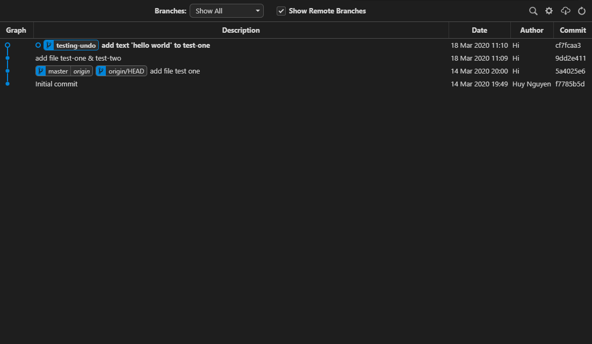

Tiếp theo, chúng ta sẽ thử chỉnh sửa một tí ở cả hai file *test-one* và *test-two*
* **test-one** mình sẽ đổi *hello world* -> *hello universe* sau đó mình stage nó luôn
* **test-two** mình sẽ thêm đoạn text *git is cool* vào nhưng không stage.

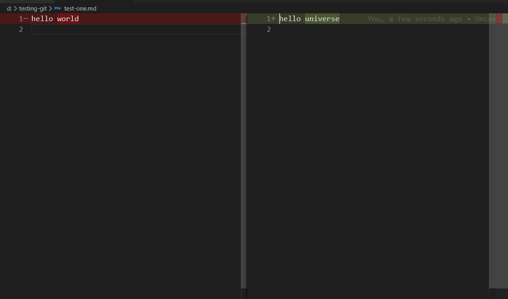
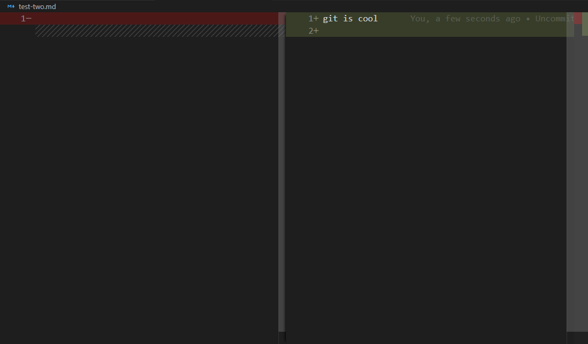
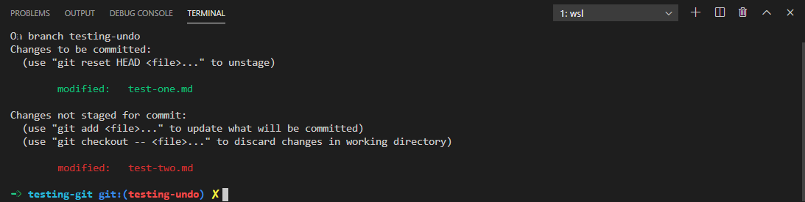

Bây giờ mình sẽ giả vờ là mình đã thao tác sai cái khỉ gì đó và cần undo lại commit **add file test-one & test-two** (tức quay lại commit lúc hai file này còn là file rỗng), vậy có làm được không? Đương nhiên là được, đã nói ở trên rồi còn gì. Rồi vậy làm như nào? Trước tiên chúng ta cần nhớ lại công thức lúc nãy xem chúng ta cần gõ gì rồi ráp vô (như làm toán vậy):
```
git reset <mode> <commit>
```
Ô kê, vì chúng ta đang thực hành với mode là `--soft` và cái commit id mà chúng ta cần quay lại là `9dd2e411`. Nhìn vào chỗ này nè:
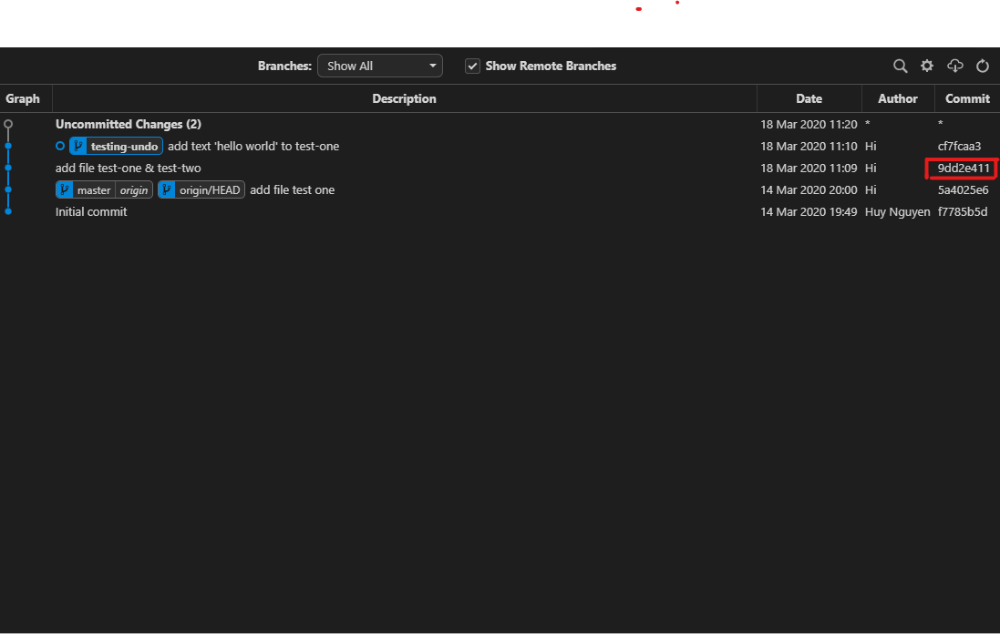
Nên đây là thứ mà chúng ta cần gõ vào terminal:
```
git reset --soft 9dd2e411
```
Để xem xem, sau khi `enter` thì chúng ta có gì:
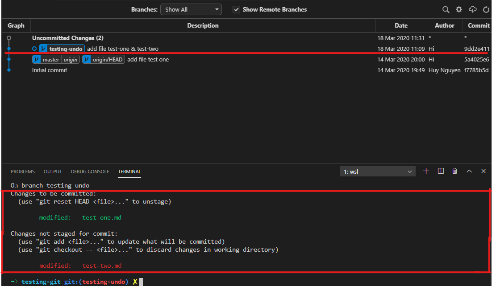
Như mong muốn, chúng ta đã undo ngược về commit `9dd2e411` thành công, bởi vì ta thấy HEAD của chúng ta giờ đã lùi lại dòng chữ **add file test-one & test-two** trên git tree rồi chứ không còn ở chỗ cũ nữa. Tuy nhiên, tiếp theo là nhìn vào `git status`, trước khi chúng ta reset thì chúng ta có stage **test-one** vào staging area còn **test-two** thì không, sau reset xem ra staging area vẫn còn nguyên trạng thái cũ, vậy nó có thực sự là nguyên vẹn hay là không? Xem thử hình dưới nào:
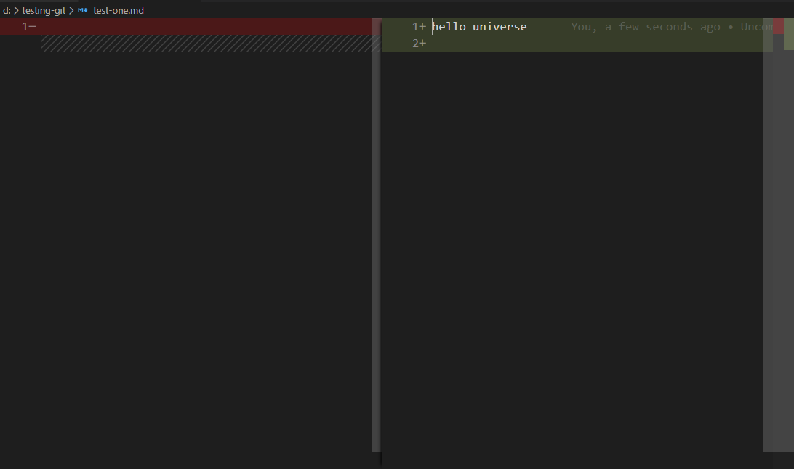
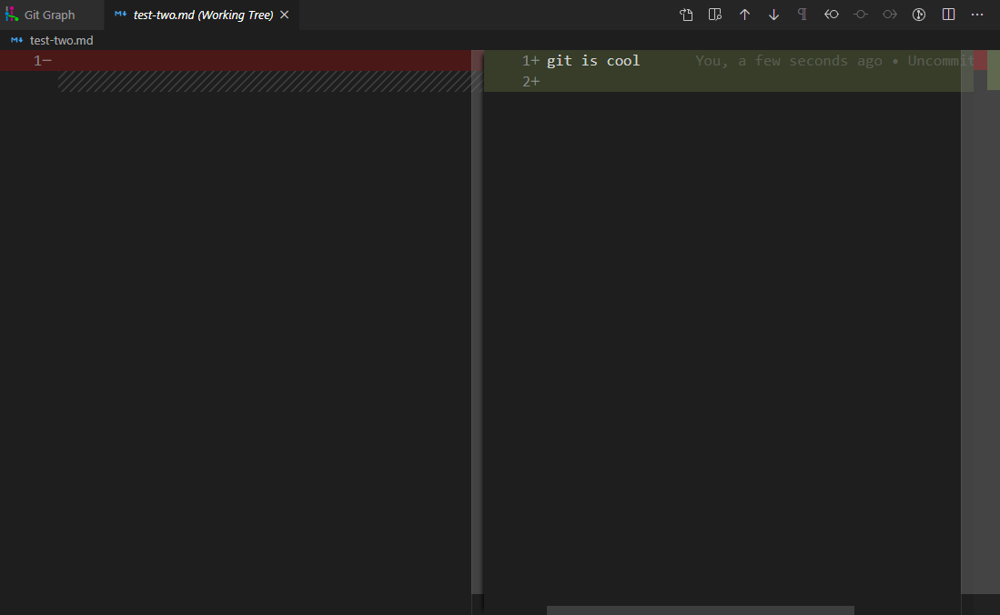

Có khác đấy, nếu như ở trước lúc chúng ta reset thì **test-one** của chúng ta thay đổi từ *hello world* -> *hello universe* (kéo lên trên xem lại nào), nhưng bây giờ nhìn xem, nó đã đổi sang từ rỗng -> *hello universe* các ông ạ (test-two thì không cần phải nói). 

Khi chúng ta undo về một commit nào đó bằng `git reset --soft` (undo cách bao nhiêu commit cũng được) thì việc trước tiên nó sẽ làm đó là reset HEAD của chúng ta lùi về đúng với cái commit đó cái đã. Tiếp theo là xem xét xem có tác động tới **working tree** và **staging area** hay không, tuy nhiên với mode `--soft` thì nó sẽ không đá động gì đến cả hai nơi này, giống như trong trường hợp ở trên của chúng ta thì **test-one** được stage với *hello world* còn **test-two** thay đổi thành *git is cool* và không được thêm vào staging area, tất cả đều được giữ nguyên hết. Chỉ khác ở chỗ, thay vì trước khi reset, những thay đổi của chúng ta là từ commit **add text ‘hello world’ to test-one** thì sau khi reset nó sẽ là thay đổi từ commit **add file test-one & test-two** sang. Thêm một điều nữa là nếu như ở commit mà chúng ta undo về có commit thay đổi của một file khác nữa (trong trường hợp này là khác 2 file **test-one** và **test-two**, như **README** chẳng hạn) thì thay đổi của file đó sẽ **tự động được thêm vào staging area luôn** (viết tới đây thì mới nhớ là nãy ~~mình làm biếng~~ quên setup cho ví dụ đó <i class="em em-lying_face" aria-role="presentation" aria-label="LYING FACE"></i>). Bạn có thể đọc lại định nghĩa gốc của `--soft` trên [git doc](https://git-scm.com/docs/git-reset):
> Does not touch the index file or the working tree at all (but resets the head to <commit>, just like all modes do). This leaves all your changed files "Changes to be committed", as git status would put it.
### `--hard` mode
Nghe tên thì biết nó hard core ra sao rồi <i class="em em-no_mouth" aria-role="presentation" aria-label="FACE WITHOUT MOUTH"></i>. Nhưng cá nhân mình thì khuyến khích sử dụng cái này thường xuyên cho lắm, trừ khi bạn biết rõ là mình đang làm gì và backup mọi thứ ok. Về cơ bản thì cách hoạt động của `--hard` cũng khá tương đồng với `--soft`. Có nghĩa là khi chúng ta dùng `git reset --hard` thì việc lùi HEAD cũng y chang như `--soft`.

**Nhưng**, có một điều chúng ta cần lưu ý khi sử dụng nó và cũng chính là lý do mà mình bảo là không khuyến khích sử dụng `--hard`. Trái với `--soft` khi chúng ta reset về thì mọi thay đổi của chúng ta đều được giữ nguyên, thì với `--hard` khi chúng ta reset về một commit nào đó, mọi thay đổi của chúng ta trên **working tree** và **staging area** đều bị mất đi (mất thật đấy <i class="em em-face_with_raised_eyebrow" aria-role="presentation" aria-label="FACE WITH ONE EYEBROW RAISED"></i>).

Đây là định nghĩa theo [git doc](https://git-scm.com/docs/git-reset)
>Resets the index and working tree. Any changes to tracked files in the working tree since <commit> are discarded.

Lấy lại ví dụ những thay đổi chúng ta đã làm với **test-one** và **test-two**, trước khi reset sẽ là như này, 3s trước thảm họa:
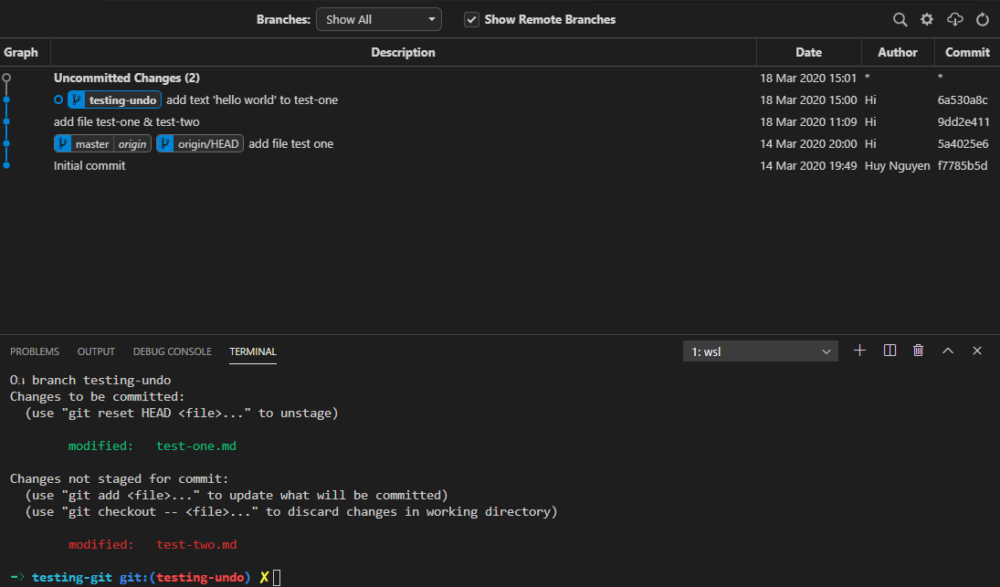

Gõ lại lệnh reset nhưng lần này mode sẽ là `--hard`
```
git reset --hard 9dd2e411
```
Và đây là kết quả:
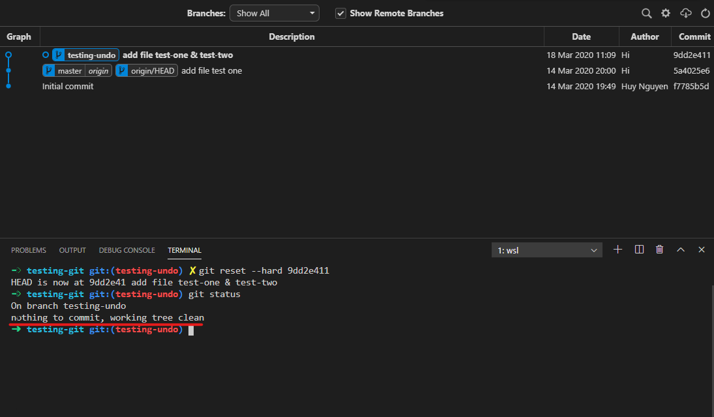
Git status trống trơn luôn <i class='em em-fearful'></i>

Như mình đã nói ở trên HEAD cũng đã được reset về đúng nơi mà nó nên ở, tuy nhiên cả **working tree** (thay đổi file test-two) và **staging area** (file test-one) cũng bay màu nốt. Vì thế cẩn thận ghi gõ `--hard` nếu như bạn vừa sáng tạo ra một thuật toán siêu cấp nào đó nhưng lại quên chưa commit nhé <i class='em em-laughing'></i>.

### `--mixed` mode
Mode thứ cuối mình muốn nhắc đến đó là `--mixed`, như đã nói ở đâu đó trên kia thì `--mixed` là mod mặc định của lệnh `git reset` thế nên nếu như chúng ta muốn xài mode này thì chỉ cần gõ `git reset <commit>` là xong. Mode này thì không "nguy hiểm" như `--hard` hay "an toàn" như `--soft`, nó kiểu giữa giữa, lưỡng tính ấy.

Tại sao mình lại kêu nó lưỡng tính? Vì khi chúng ta reset commit bằng `--mixed` thì đương nhiên trước hết là lùi HEAD về commit đã chọn như bao mode khác, nhưng với `--mixed`, nó sẽ tác động lên các file ở **staging area** còn **working tree** thì không. Nhưng tác động lên **staging area** thì cụ thể nó làm gì? Nó không thổi bay luôn mấy thay đổi đó như `--hard` đâu, đừng lo. Mà thay vào đó `--mixed` vẫn giữ các thay đổi mà chúng ta đã thao tác trên các file ở **staging area** nhưng nó sẽ **đưa tất cả các file ở staging area về lại working tree**, các file đã ở **working tree** sẵn rồi thì không bị làm sao cả, thêm một cái nữa nếu ta lùi về commit có file bị thay đổi khác với các file chúng ta đang thay đổi hiện giờ thì file đó cũng bị đưa về **working tree** nốt.

Giả sử chúng ta có cây git như thế này, đại khái thì nó vẫn tương tự ví dụ cũ thôi, nhưng thay vào đó mình chèn thêm 2 commit phía trước, có thêm một file nữa là **test-three** và thêm text vào file đó nữa.
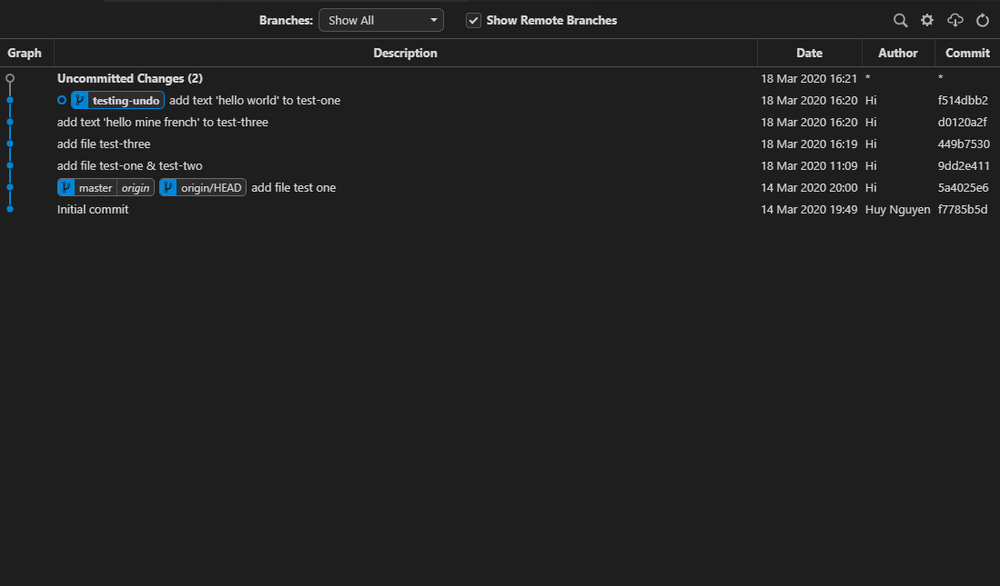

Những thay đổi còn lại thì cũng y chang ví dụ trên:
> * **test-one** mình sẽ đổi *hello world* -> *hello universe* sau đó mình stage nó luôn
> * **test-two** mình sẽ thêm đoạn text *git is cool* vào nhưng không stage.

Nếu bây giờ chúng ta thử reset về commit **add file test-three** (tức nghĩa là lúc này file **test-one** và **test-two** vẫn đang rỗng, nhưng trước đó chúng ta lại có một thay đổi ở file **test-three** rồi) thì cùng để xem nó như nào.

Gõ thôi:
```
git reset 449b7530
```
Và đây là kết quả của chúng ta:
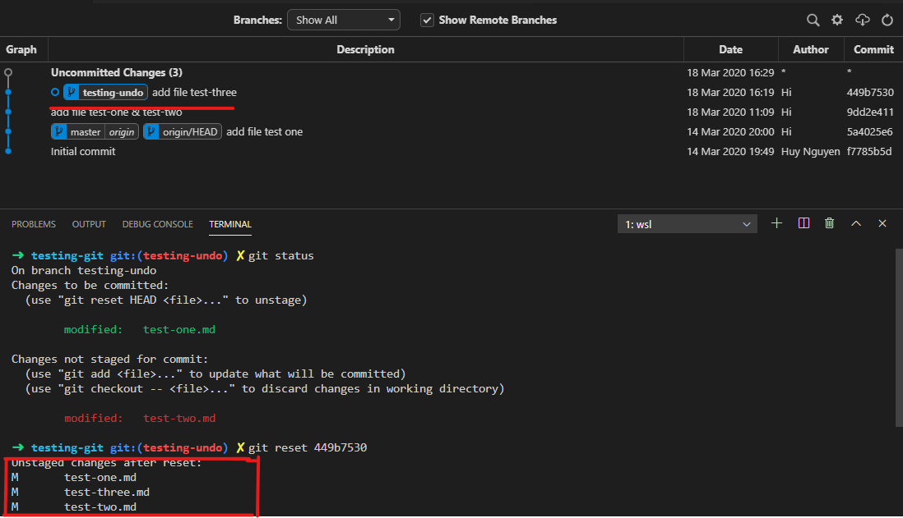

Chúng ta đã lùi commit thành công, tuy nhiên thông báo các file thay đổi có vẻ hơi lạ, có cả sự xuất hiện của file **test-three** mặc dù trước đó chúng ta chỉ thay đổi hai file **test-one** và **test-two** <i class="em em-face_with_raised_eyebrow" aria-role="presentation" aria-label="FACE WITH ONE EYEBROW RAISED"></i>. Như đã nói ở trên thì: *thêm một cái nữa nếu ta lùi về commit có file bị thay đổi khác với các file chúng ta đang thay đổi hiện giờ thì file đó cũng bị đưa về **working tree** nốt.* Vậy nên khi reset commit này chúng ta sẽ có luôn sự thay đổi của **test-three** và dĩ nhiên là nó sẽ được đặt ở **working tree**.
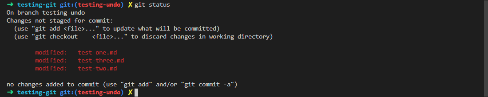

### Bonus
Nếu như bạn thấy việc tìm commit id để undo về là quá cực nhọc và bạn không thích dùng nó, trong khi bạn có một trí nhớ thượng thừa có thể nhớ hết những lần mình commit (hay được hơn là bạn vẫn mỡ git tree lên đếm số lần commit chứ ghét ứ xài commit id thì vẫn hoang hô <i class='em em-flushed'></i>). Thì bạn có thể dùng 
```
git reset <mode> HEAD~<số commit muốn lùi> # nhớ chỗ này là số nha 1,2,3,... đồ ấy
```
Lấy luôn ví dụ cuối ở cái `--mixed` phía trên, thay vì chúng ta gõ `git reset 449b7530` gì gì đó thì có thể đổi sang thành:
```
git reset HEAD~2
```
Trông hay hơn nhỉ <i class='em em-grin'></i>

___
Rồi, bài cũng dài vãi chưởng rồi, hi vọng đọc xong thì mình có thể giúp bạn được ở khoản nào đó trong quá trình sử dụng Git. Tuy nhiên cứ code cần thận để không phải undo như này thì tuyệt nhất, cứ xem nó là cách chữa cháy thôi nhé. Vậy nha, chào thân ái và quyết liệt <i class='em em-hand'></i>.


<<<<<Blog-Meta-Data>>>>>
title:Undo trong git là như nào?;publishMode:publish;tags:git;date:2020/03/18 00:00:00;